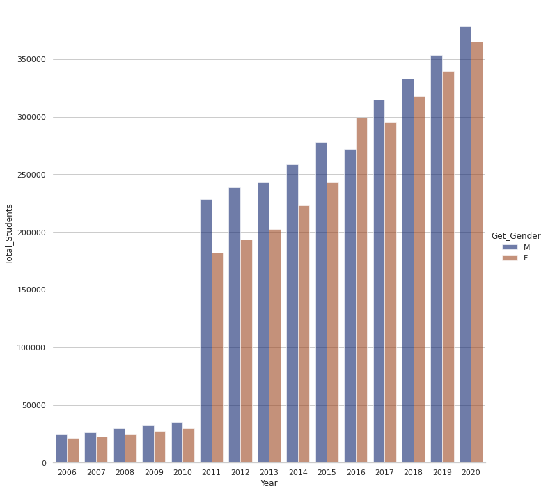
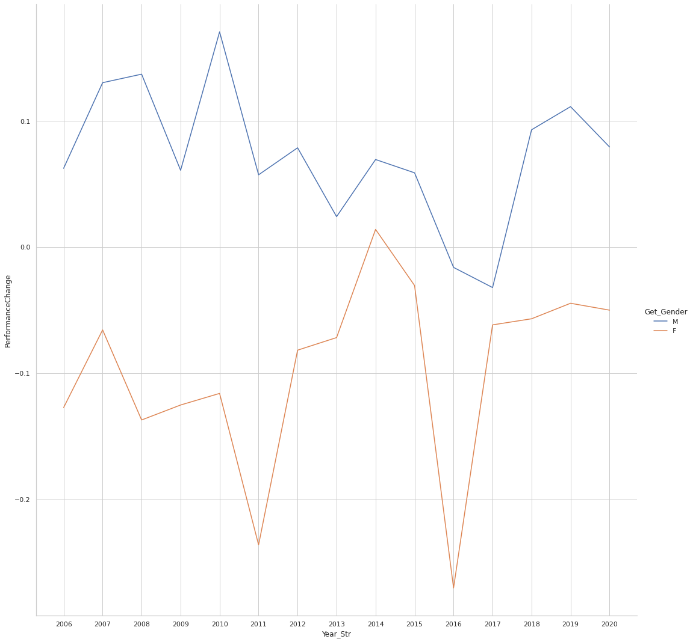
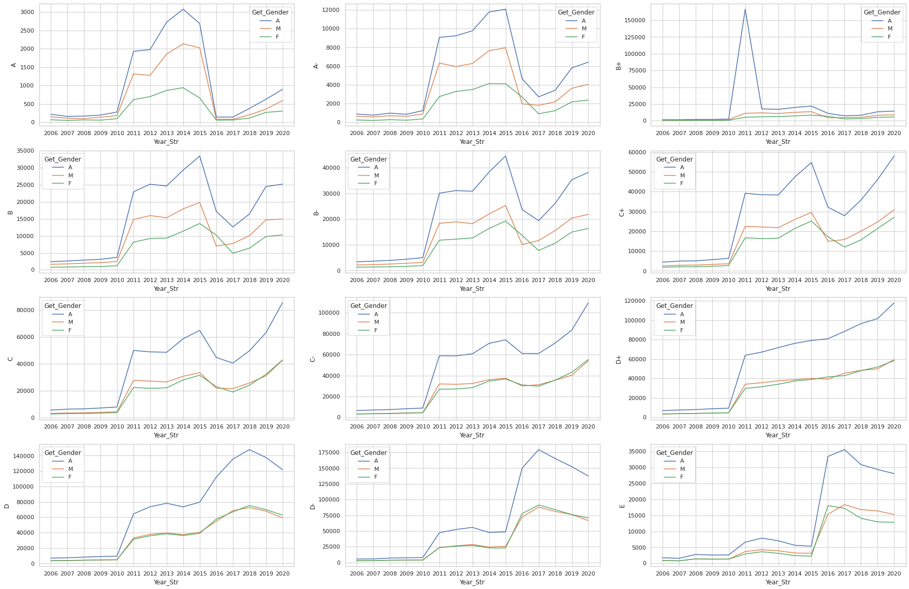
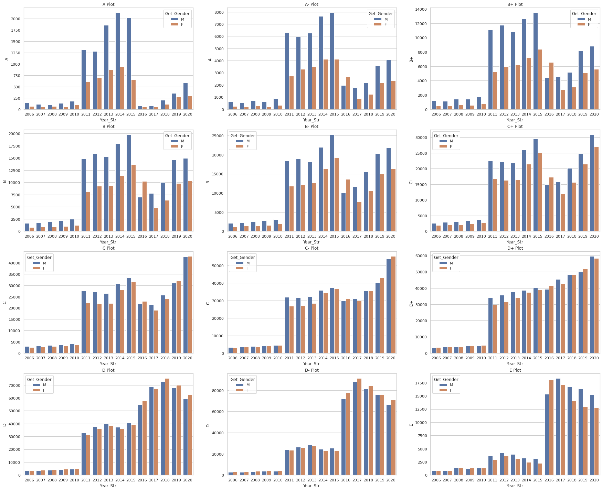
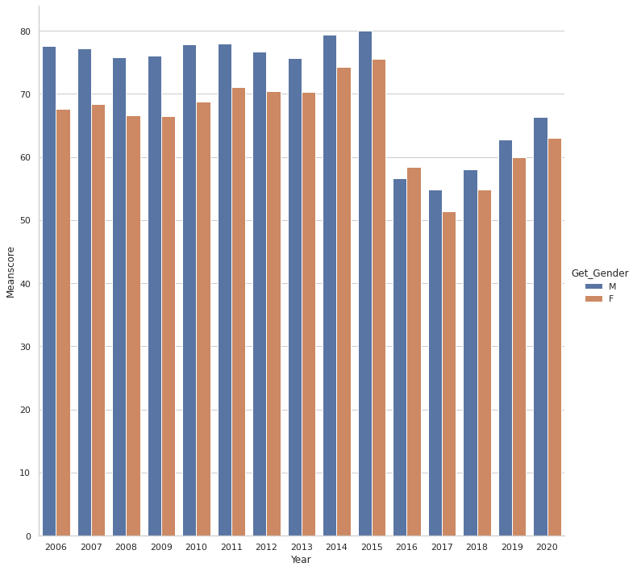
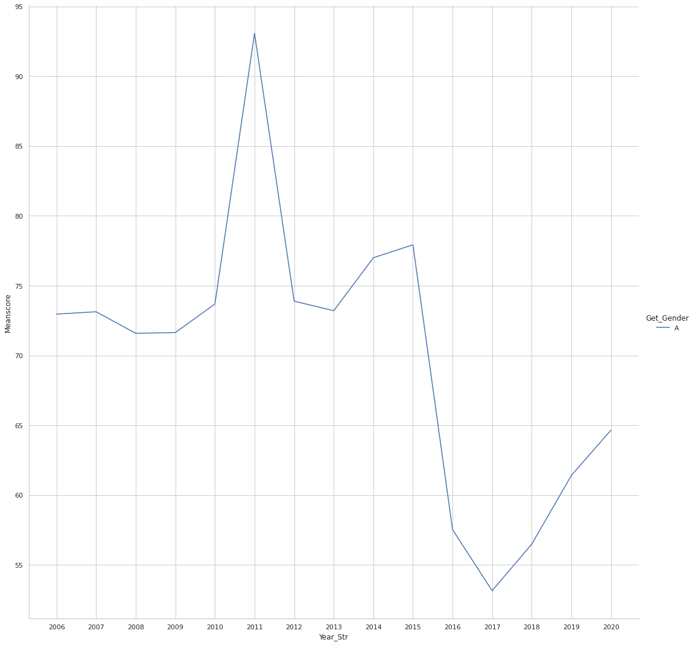

<!--
*** Thanks for checking out the Kamilimu-DS-Track-assignment-1. If you have a suggestion
*** that would make this better, please fork the repo and create a pull request
*** or simply open an issue with the tag "enhancement".
*** Don't forget to give the project a star!
*** Thanks again! Now go create something AMAZING! :D
-->

<!-- PROJECT SHIELDS -->
<!--
*** I'm using markdown "reference style" links for readability.
*** Reference links are enclosed in brackets [ ] instead of parentheses ( ).
*** See the bottom of this document for the declaration of the reference variables
*** for contributors-url, forks-url, etc. This is an optional, concise syntax you may use.
*** https://www.markdownguide.org/basic-syntax/#reference-style-links
-->
[![Contributors][contributors-shield]][contributors-url]
[![Forks][forks-shield]][forks-url]
[![Stargazers][stars-shield]][stars-url]
[![Issues][issues-shield]][issues-url]
[![MIT License][license-shield]][license-url]
[![LinkedIn][linkedin-shield]][linkedin-url]

<!-- ABOUT THE PROJECT -->
## About The Project
Given the data on KCSE performance, explore the data and generate a report on your findings.

Objectives:

    Percentage change in enrollment for both genders ✅
    Percentage change in performance for both genders ✅
    Comparison of distribution of genders per grade per year✅
    Yearly gender that performed the best✅
    Overall performance yearly✅

<!-- FINDINGS -->

## Findings

### 1. Yearly enrollment for both gender

    After 2010, the number of kcse students dramatically increased.In 2003, the governemnt introduced free primary education and in 2008 free secondary day school education. This factors can be attributed to the number of students having shot up
    In 2016 more female students sat for the exams as compared to male students

### 2. Change in performance for both genders

    Performance declined sharply in 2016. This was also the period CS MAtiangi was the CS for education.
    In 2016 girls, the performance change was off for girls than for boys

### 3. Comparison of distribution of genders per grade per year

    On average boys have high numbers in every grade
    2011 to 2015 more boys had A's as compared to girls, but come 2016 when the rate of exam cheating was very low, the number of A's between girls and boys was very close. Would this mean in general boys cheat one xams more than girls?
    In 2016 more females had E's than males. It was also the only year the number of E's was higher for females than male.

### 4. Yearly gender that performed the best

    In 2016 girls performed better than boys
    All other years apart from 2016, men exceed the ladies

### 5. Overall performance yearly

    2011 was the best overall performing year
    2017 was the worst performing year overall

<!-- LICENSE -->
## License

Distributed under the MIT License. See `LICENSE.txt` for more information.

(<a href="#top">back to top</a>)

<!-- CONTACT -->
## Contact

Tweet me at- [@wamaithanyamu](https://twitter.com/wamaithanyamu) 
Shoot me an email- hello@wamaithanyamu.com

Project Link: [https://github.com/wamaithanyamu/Kamilimu-DS-Track-assignment-1](https://github.com/wamaithanyamu/Kamilimu-DS-Track-assignment-1)

(<a href="#top">back to top</a>)

<!-- MARKDOWN LINKS & IMAGES -->
<!-- https://www.markdownguide.org/basic-syntax/#reference-style-links -->
[contributors-shield]: https://img.shields.io/github/contributors/wamaithanyamu/Kamilimu-DS-Track-assignment-1.svg?style=for-the-badge
[contributors-url]: https://github.com/wamaithanyamu/Kamilimu-DS-Track-assignment-1/graphs/contributors
[forks-shield]: https://img.shields.io/github/forks/wamaithanyamu/Kamilimu-DS-Track-assignment-1.svg?style=for-the-badge
[forks-url]: https://github.com/wamaithanyamu/Kamilimu-DS-Track-assignment-1/network/members
[stars-shield]: https://img.shields.io/github/stars/wamaithanyamu/Kamilimu-DS-Track-assignment-1.svg?style=for-the-badge
[stars-url]: https://github.com/wamaithanyamu/Kamilimu-DS-Track-assignment-1/stargazers
[issues-shield]: https://img.shields.io/github/issues/wamaithanyamu/Kamilimu-DS-Track-assignment-1.svg?style=for-the-badge
[issues-url]: https://github.com/wamaithanyamu/Kamilimu-DS-Track-assignment-1/issues
[license-shield]: https://img.shields.io/github/license/wamaithanyamu/Kamilimu-DS-Track-assignment-1.svg?style=for-the-badge
[license-url]: https://github.com/wamaithanyamu/Kamilimu-DS-Track-assignment-1/blob/master/LICENSE.txt
[linkedin-shield]: https://img.shields.io/badge/-LinkedIn-black.svg?style=for-the-badge&logo=linkedin&colorB=555
[linkedin-url]: https://linkedin.com/in/wamaithanyamu
[product-screenshot]: images/screenshot.png
